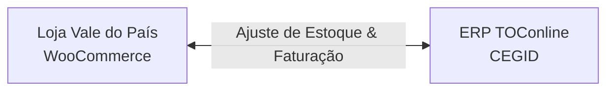

# Manual de Utilização: Sincronizador WooCommerce CEGID Sync

Este manual detalha o funcionamento, configuração e operação diária do ecossistema de integração do **Sincronizador WC CEGID Sync**, projetado especificamente para conectar a sua loja online **Vale do País** (WooCommerce) ao software de gestão e faturação certificada **TOConline (CEGID)**.

---

## 1. O Ecossistema de Integração

O ecossistema é composto por dois sistemas principais trabalhando em conjunto para simplificar a sua gestão comercial e fiscal:

1. **WooCommerce (Vale do País):** A sua montra de vendas online (`https://valedopais.farm/`), onde os clientes realizam pedidos de produtos.
2. **TOConline (CEGID):** O seu sistema central de gestão empresarial e faturação oficial, certificado pela Autoridade Tributária (AT) de Portugal. É onde reside o cadastro mestre de inventário e onde são gerados os documentos fiscais definitivos.

O plugin atua como a **ponte de comunicação** entre estes dois sistemas, eliminando o trabalho manual de atualizar inventários e de preencher faturas de venda no portal do TOConline.

---

## 2. O que é AUTOMÁTICO no Sistema

Os processos listados abaixo correm silenciosamente em segundo plano, sem necessidade de qualquer clique ou intervenção humana:

* **Sincronização Periódica de Estoques (Duas vezes ao dia):** Uma tarefa automatizada (WP-Cron) corre em segundo plano a cada 12 horas. Ela consulta as quantidades físicas reais de cada produto no inventário da CEGID e atualiza as existências correspondentes na loja WooCommerce.
* **Renovação de Credenciais e Tokens OAuth2:** O sistema de segurança do plugin gerencia e renova automaticamente os tokens de acesso com os servidores da CEGID sempre que eles expiram, garantindo comunicação ininterrupta sem que o administrador precise fazer login novamente.
* **Validação de Licença de Uso:** O sistema possui uma validação de bypass vitalícia e integrada. Ele detecta a máquina de produção da Vale do País e valida o licenciamento de desenvolvimento de forma totalmente automática, mantendo todas as abas e botões do plugin sempre desbloqueados.

---

## 3. Sistema de Dicas de Ferramenta e Guias Rápidos Integrados

Para tornar a utilização intuitiva e eliminar qualquer dúvida operacional no dia a dia, todas as telas do ecossistema agora contam com **dupla camada de auxílio visual**:

1. **Caixas de Guia Rápido no Topo de Cada Aba (Accordion Expansível):**
   * No topo das abas **Validação de Faturas**, **Sincronizar Estoques**, **Logs de Auditoria**, **Ativação da Licença** e **Configurações**, existe um painel com o ícone **💡 Guia Rápido**.
   * Esse bloco organiza em cartões numerados e coloridos o passo a passo exato do que você deve fazer naquela tela.
   * Se preferir mais espaço na tela, basta clicar em **"Ocultar / Mostrar Dicas"** no canto do cartão para recolhê-lo.
2. **Dicas de Ferramenta Flutuantes (Tooltips ao Passar o Mouse):**
   * Ao posicionar o cursor do mouse (ou tocar no celular) sobre qualquer **botão**, **cabeçalho de coluna** ou **ícone de ajuda ()**, uma caixinha preta flutuante surge na hora explicando a função daquele elemento, para que serve e o que acontece ao clicar.

---

## 4. O que é MANUAL no Sistema

Para garantir total controle administrativo e conformidade fiscal, certas operações exigem uma ação manual do gestor:

* **Emissão e Assinatura de Faturas Fiscais:** Para evitar erros tributários e garantir que apenas pedidos válidos sejam faturados, a geração de documentos é manual. O administrador deve revisar os pedidos concluídos na aba **Validação de Faturas** e clicar em **"Emitir Fatura"** para processar e assinar digitalmente o documento no TOConline.
* **Mover Pedidos Indesejados para a Lixeira (Suprimir):** Caso um pedido concluído tenha sido cancelado ou não deva ser faturado por algum motivo, o administrador pode clicar em **"Suprimir"** para movê-lo automaticamente para a lixeira do WooCommerce, retirando-o da listagem de faturação.
* **Ajustar Dados do Pedido (Editar):** Se o cliente solicitou alteração no NIF, nome ou produtos antes da emissão da fatura, o administrador deve clicar em **"Editar"** para ajustar o pedido no WooCommerce.
* **Cadastrar Produtos Pendentes na CEGID:** Caso cadastre um novo produto no WooCommerce e precise que ele exista no TOConline antes mesmo de sua primeira venda, o administrador pode clicar em **"Cadastrar Artigo"** na linha correspondente na aba de estoques.
* **Verificar Vínculos em Lote:** Se você já tinha produtos cadastrados diretamente no TOConline e quer associá-los de forma inteligente aos produtos com o mesmo SKU na sua loja WooCommerce, basta clicar em **"Verificar Vínculos na CEGID"** no topo.
* **Forçar Sincronização de Estoque (PULL da CEGID):** Para atualizar instantaneamente as existências do WooCommerce com o saldo real do TOConline, clique em **"Sincronizar Estoques (PULL da CEGID)"**.
* **Recarregar Dados da Loja (Sincronizar com WooCommerce):** Se você acabou de alterar a quantidade de estoque de um produto no WooCommerce ou editou dados de um pedido e deseja ver essa informação refletida na tela do plugin na hora, clique no botão **"Sincronizar com WooCommerce (Recarregar)"** (na aba de estoques) ou **"Sincronizar Pedidos (Recarregar)"** (na aba de faturas).
* **Configurações e Parâmetros Fiscais:** A definição de séries de faturamento (ex: `OLIAK`), tipos de documento (`FT`, `FS`, `FR`) e preenchimento de novas credenciais da API da CEGID são feitos manualmente na aba **Configurações**.

---

## 4. Guia de Preenchimento de Campos (Configuração de Produção)

Para preencher a tela de **Configurações** em produção no site da **Vale do País**, insira os dados exatamente como detalhado abaixo:

| Campo na Tela | Valor a Preencher | Descrição / Instrução |
| :--- | :--- | :--- |
| **Ambiente Sandbox / Testes** | **DESMARCADO** | Mantenha desativado para emitir faturas reais com valor fiscal na CEGID. |
| **Client ID** | *[O seu Client ID obtido no TOConline]* | Identificador único de integração fornecido pela CEGID. |
| **Client Secret** | *[O seu Client Secret obtido no TOConline]* | Chave secreta de integração fornecida pela CEGID. |
| **Utilizador / E-mail** | *[E-mail de acesso ao TOConline]* | O e-mail cadastrado que você utiliza para fazer login no TOConline da sua empresa. |
| **Senha** | *[Senha de acesso ao TOConline]* | A senha do utilizador acima para login no TOConline. |
| **NIF da Empresa** | *[NIF de 9 dígitos da empresa]* | O Número de Identificação Fiscal da empresa (NIF de Portugal, apenas os 9 dígitos). |
| **URL Base da API** | `https://api3.business-pt.cegid.cloud` | Endereço do cluster 3 da API oficial da CEGID para produção. |
| **URL de Autenticação (OAuth)** | `https://app3.business-pt.cegid.cloud/oauth` | Endereço de autenticação OAuth do cluster 3 da CEGID. |
| **Tipo de Documento Padrão** | **Fatura (FT)** ou **Fatura-Recibo (FR)** | Selecione **Fatura-Recibo (FR)** caso suas vendas diretas devam ser liquidadas como fatura-recibo, ou **Fatura (FT)** para faturas a prazo. *Atenção:* Documentos FT aparecem no menu de Faturas da CEGID, enquanto FR aparecem no menu de Faturas-Recibo. |
| **Prefixo da Série de Documentos** | `OLIAK` | Série ativa cadastrada no TOConline para a olivicultura da Vale do País. **Importante:** Não utilize a série `CONAK` aqui e garanta que a série está aberta para o tipo de documento escolhido (FT ou FR). |
| **Emitir e Finalizar Automaticamente** | **MARCADO (Ativado)** | Se ativado, o documento é emitido oficialmente e finalizado na CEGID. Se desmarcado, ele é gerado como **Rascunho** (visível apenas filtrando por rascunhos no TOConline). |
| **Descritor de IVA Padrão** | `IVA-M23` | Código de imposto padrão que o TOConline usará ao criar novos produtos via plugin (ex: taxa normal de 23% em Portugal). |
| **Unidade de Medida Padrão** | `unidade` | Unidade de medida padrão usada para o inventário dos novos produtos cadastrados (ex: unidade, litro, kg). |
| **Motivo de Isenção de IVA Padrão** | *[Deixe em branco]* | Preencha apenas se seus produtos forem isentos de imposto (exige a menção da lei portuguesa). |
| **Enviar Automaticamente ao Publicar** | **Opcional (Desmarcado)** | Se ativado, toda vez que você publicar um novo produto no site, o plugin tentará cadastrá-lo automaticamente na CEGID. |

---

## 5. Guia Operacional Diário

### A. Gestão e Emissão de Faturas (Aba "Validação de Faturas")

Esta aba exibe a lista em tempo real de pedidos WooCommerce marcados recentemente como **Concluídos** que ainda não possuem fatura gerada no TOConline.

* **Como Emitir Fatura:** Clique no botão azul **"Emitir Fatura"** ao lado do pedido desejado. O sistema comunicará com a CEGID e assinará digitalmente o documento. O botão se transformará em **"Ver Fatura PDF"** para você abrir e descarregar o documento fiscal assinado.
* **Como Editar um Pedido:** Se precisar corrigir alguma informação (como adicionar o NIF ou alterar dados do cliente) antes de emitir a fatura, clique no botão **"Editar"** correspondente. O WordPress abrirá a tela de edição nativa daquele pedido em uma nova aba do seu navegador. Após salvar a alteração, retorne à tela do plugin e clique em **"Sincronizar Pedidos (Recarregar)"** no topo para atualizar os dados do pedido na lista.
* **Como Suprimir (Deletar) um Pedido da Lista:** Se um pedido foi cancelado, foi um teste ou não deve ser faturado de forma alguma, clique no botão vermelho **"Suprimir"**. O plugin pedirá uma confirmação e, ao aceitar, moverá automaticamente o pedido para a **Lixeira do WooCommerce**, removendo a linha correspondente da tabela do plugin.
* **Ações em Massa (Suprimir Vários Pedidos de Uma Vez):**
  1. Marque as caixas de seleção (checkboxes) na primeira coluna ao lado dos pedidos que deseja suprimir (ou marque o checkbox do cabeçalho para selecionar todos).
  2. No menu suspenso **"Ações em Massa"** no canto superior direito, selecione a opção **"Suprimir (Lixeira)"**.
  3. Clique no botão **"Aplicar"** ao lado do menu. Confirme o aviso na tela e todos os pedidos marcados serão movidos em lote para a lixeira do WooCommerce instantaneamente.
* **Como Recarregar a Lista de Pedidos:** Caso tenha editado pedidos no WooCommerce e queira ver os novos valores e alterações refletidos na lista antes de faturar, clique no botão **"Sincronizar Pedidos (Recarregar)"** no topo. A lista atualizará na hora com um aviso de sucesso em verde no canto da tela.
* **Como Acessar PDFs de Pedidos Antigos:** Vá no menu lateral *WooCommerce > Pedidos*, abra o pedido desejado e localize o bloco lateral **"Fatura CEGID (TOConline)"** para ver a referência fiscal e baixar o PDF definitivo.

### B. Gestão de Artigos e Existências (Aba "Sincronizar Estoques")

Esta aba lista todos os produtos e variações da loja que possuem SKU e gerencia o vínculo e as quantidades de inventário comparando o WooCommerce e o TOConline.

* **Filtro de Status (Visualização Rápida de Pendentes):**
  Ao lado das Ações em Massa no topo direito da tabela, você pode usar o dropdown de filtro para selecionar **"Apenas Pendentes"**. A tabela será filtrada na hora no seu navegador, **exibindo apenas os novos produtos que ainda não foram vinculados ou enviados para a CEGID**. Isso permite que você marque a caixa de seleção deles e faça o cadastro em lote imediatamente.
* **Diferenciação Automática de Tipos (Produtos vs Serviços):**
  * **Produtos Físicos (Simple Products / Variações Físicas):** Itens tangíveis que controlam estoque são cadastrados automaticamente na página **Empresa > Itens > Produtos** no CEGID Business, com tipo de inventário físico/mercadoria.
  * **Assinaturas (Simple Subscriptions / Variable Subscriptions) e Virtuais:** São classificadas automaticamente como **Serviços**, sendo cadastradas na página **Empresa > Itens > Serviços** no CEGID Business. O plugin reconhece o tipo de assinatura mesmo se o checkbox "Virtual" do WooCommerce não tiver sido marcado manualmente.
  * **Identificação Visual na Tabela:** Cada item exibe uma etiqueta informativa:
    * 🟣 `Serviço / Assinatura`: cadastrado na aba de Serviços do CEGID (não requer controle de inventário físico).
    * ⚪ `Produto Físico`: cadastrado na aba de Produtos do CEGID (gerencia estoque).
* **Entendendo as Colunas:**
  * **Estoque WooCommerce:** A quantidade de estoque disponível para venda online no seu site (para Serviços/Assinaturas, exibe a etiqueta 🟣 `Serviço`).
  * **Estoque CEGID:** O saldo de estoque físico retornado pela API da CEGID:
    * Se for um **Serviço/Assinatura**, exibe a etiqueta 🟣 `Serviço` (serviços não movimentam estoque físico).
    * Se a API da CEGID não disponibilizar campo de saldo em armazém para o artigo, exibe `— (Não exposto na API)`. **Importante:** Nessa situação, o plugin protege o seu estoque e **NUNCA zera o estoque do WooCommerce**, mantendo o saldo da sua loja online 100% preservado e seguro.
    * Se a CEGID retornar um saldo numérico real, este saldo é exibido aqui e atualizado no WooCommerce.
  * **Cadastro CEGID (Status de Vínculo):**
    * 🟢 **CADASTRADO:** Indica que o produto já possui vínculo e ID válidos dentro do TOConline (na área de Produtos ou na área de Serviços).
    * 🟡 **PENDENTE:** Indica que o SKU ainda não possui vínculo no TOConline.
* **Como Cadastrar / Vincular um Produto Individual na CEGID:** Se o status estiver como 🟡 **PENDENTE**, clique no botão azul **"Cadastrar Artigo"**. O plugin processará o item de forma inteligente:
  * Se for **Assinatura (Simple Subscription)**, o plugin busca e cadastra o item diretamente na área de **Serviços** (`/api/services`) da CEGID.
  * Se o artigo **já existia previamente na CEGID** (como serviço ou produto), o plugin detecta automaticamente o cadastro existente, associa o ID e converte o status na hora para 🟢 **CADASTRADO**, mudando o botão azul diretamente para **"Sincronizar Estoque"** (eliminando o erro `JA011: Já existe um registo com o codigo...`).
  * Se for **Produto Simples Físico**, o plugin cria o item na área de **Produtos** da CEGID.
* **Como Desvincular e Recadastrar um Artigo:**
  * Ao lado do botão "Sincronizar Estoque", existe um botão com ícone de elo desfeito ().
  * **Caso Prático (Correção de Artigos):** Se um produto foi cadastrado incorretamente no CEGID (por exemplo, uma assinatura que foi cadastrada no passado na página de Produtos em vez de Serviços), basta excluir o artigo na página de Produtos do CEGID, clicar no botão de desvincular no WooCommerce e em seguida clicar em **"Cadastrar Artigo"**. O plugin recadastrará o artigo imediatamente na página correta (**Serviços**) do CEGID!
* **Como Verificar e Vincular Todos os Produtos Pré-existentes de Uma Só Vez:** Basta clicar no botão **"Verificar Vínculos na CEGID"** no topo da tabela de estoques. O plugin varrerá todos os produtos pendentes que já foram cadastrados manualmente no CEGID e associará os IDs em lote, transformando todos os botões azuis em **"Sincronizar Estoque"** automaticamente.
* **Ações em Massa de Produtos (Cadastro e Sincronização em Lote):**
  1. Marque as caixas de seleção dos produtos que deseja gerenciar (ou use o checkbox do cabeçalho da tabela para marcar todos).
  2. No menu suspenso **"Ações em Massa"** no canto superior direito, escolha a operação desejada:
     * **Sincronizar Estoques:** Atualiza as existências de todos os produtos marcados de uma só vez puxando os saldos da CEGID.
     * **Cadastrar na CEGID:** Envia e cadastra na CEGID todos os itens marcados de uma só vez (válido para itens com status 🟡 **PENDENTE**).
  3. Clique em **"Aplicar"** para processar a fila em lote. A tabela recarregará com as informações atualizadas.
* **Como Sincronizar Estoque Imediatamente (PULL da CEGID):**
  * **Sincronização Geral (Toda a Loja):** Clique no botão azul **"Sincronizar Estoques (PULL da CEGID)"** no topo. O plugin consultará as quantidades reais de todos os itens cadastrados no TOConline e atualizará o WooCommerce com essas quantidades, exibindo as alterações nas duas colunas após o carregamento.
  * **Sincronização de um Único Item:** Se quiser atualizar o saldo de apenas um produto, pesquise o SKU dele na tabela e clique no botão circular **"Sincronizar Estoque"** na linha dele (este botão só fica disponível se o item estiver 🟢 **CADASTRADO**).
* **Como Recarregar a Tabela de Estoques:** Se você alterou manualmente o estoque de algum produto nas páginas normais do WooCommerce e quer atualizar os valores exibidos na tabela do plugin para comparação, clique no botão **"Sincronizar com WooCommerce (Recarregar)"** no topo. A tabela atualizará com as informações locais atuais do site.

### C. Diagnóstico e Auditoria (Aba "Logs de Auditoria")

Esta aba contém o console escuro de auditoria técnica da comunicação entre o WooCommerce e a CEGID em tempo real:

* **Inspecionar Detalhes e Payloads:** Sempre que houver uma requisição detalhada ou erro retornado pela CEGID, a linha correspondente exibirá a opção **"🔍 Inspecionar Dados Técnicos & Payload"**. Ao clicar, abre-se um painel com o JSON completo que foi enviado e a resposta exata recebida do servidor da CEGID, permitindo identificar com precisão qualquer campo ou regra fiscal recusada.
* **Copiar Logs com 1 Clique:** Utilize o botão **"Copiar Logs"** no topo da tela para exportar todo o histórico de logs formatado diretamente para a área de transferência do seu computador ou celular, facilitando o envio rápido para a equipe técnica ou para o suporte via WhatsApp.
* **Testar Conexão Agora:** Clique neste botão para validar instantaneamente se o Token OAuth2 e a comunicação com a nuvem da CEGID estão operacionais.
* **Limpar Logs:** Remove registros antigos de auditoria do banco de dados quando necessário.

---

## 6. Painel de Gestão de Licenças (CEGID License Server)

Para gerenciar o acesso e emissão de chaves para clientes ou lojas adicionais:

1. **Acessando o Painel:**
   * Acesse a URL do servidor de licenças (ex: `https://licenca.valedopais.com` ou o IP da VPS configurado).
2. **Gerar Nova Licença:**
   * Preencha o **Nome do Cliente / Empresa** e o **NIF / Documento**.
   * Opcionalmente, defina um **Domínio Autorizado** prévio (ou deixe vazio para que o plugin vincule o domínio automaticamente no primeiro uso).
   * Escolha a validade através dos botões de atalho rápido (**+1 Mês**, **+6 Meses**, **+1 Ano**, **Vitalícia (10 Anos)**) ou selecione uma data específica no calendário.
   * Você pode digitar uma chave personalizada ou clicar no botão **"Gerar Chave"** para criar um código seguro no formato padrão `VP-XXXX-XXXX-XXXX`.
   * Clique em **"Cadastrar Licença"**.
3. **Gerenciar Licenças Existentes:**
   * **Copiar Chave:** Clique no ícone de cópia ao lado de qualquer chave na tabela para copiá-la para a área de transferência.
   * **Suspender / Reativar:** Clique no botão de status (🟢 Ativa / ⏸️ Suspender) para pausar ou restabelecer imediatamente o funcionamento do plugin no cliente.
   * **Resetar Domínio (🔄 Reset Domínio):** Caso o cliente tenha migrado de domínio ou precise reativar a chave em outro ambiente, clique em Reset Domínio para desvincular o site atual e permitir nova ativação sem precisar criar uma nova chave.
   * **Excluir:** Remove a licença do banco de dados.
4. **Ativação no WordPress:**
   * No painel do WordPress (`CEGID Sync > Licença`), informe a URL do servidor, insira a chave gerada e clique em **"Ativar Licença"**.

